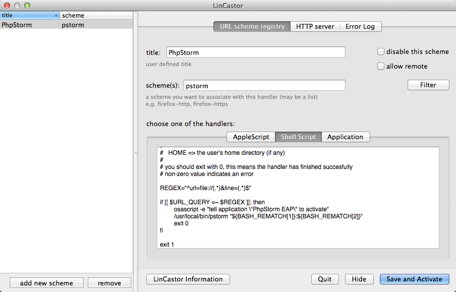

# Installing on Mac

Since PhpStormProtocol doesn't work as expected on OS X 10.9 (Mavericks), then I suggest using alternative solution that involves installing LinCastor app.

1. download the __LinCastor.app__ from the [http://onflapp.wordpress.com/lincastor/](http://onflapp.wordpress.com/lincastor/) page
2. unpack and move to __Applications__ folder
3. create new protocol handler using configuration from below:

4. specify `phpstorm://open?url=file://%f&line=%l` in your debugger configuration (e.g. in the `xdebug.file_link_format` setting in the `php.ini`)
5. you maybe need to use different file and line placeholders (instead of `%f` and `%l`) depending on which debugger you're configuring:
 * `%F` and `%L` - for [In-Portal Debugger](http://www.in-portal.org/)
 * `%file` and `%line` - for [Nette Debugger](http://pla.nette.org/en/how-open-files-in-ide-from-debugger)

## LinCastor Shell Script

```bash
#!/bin/sh
# the script will execute with following environmental variables defined:
#   URL_SCHEME   => my-http
#   URL_HOST     => myhost.domain.com
#   URL_PORT     => 8080
#   URL_QUERY    => ?search=blah
#   URL_PATH     => /mysite/a.html
#   URL_FRAGMENT => #myanchor
#
#   HOME => the user's home directory (if any)
#
# you should exit with 0, this means the handler has finished succesfully
# non-zero value indicates an error

REGEX="^url=file://(.*)&line=(.*)$"

if [[ $URL_QUERY =~ $REGEX ]]; then
	#Depending on which version of PHPStorm you're running, uncomment the appropriate app name:
	#osascript -e "tell application \"PhpStorm EAP\" to activate"
	#osascript -e "tell application \"PhpStorm\" to activate"
	/usr/local/bin/pstorm "${BASH_REMATCH[1]}:${BASH_REMATCH[2]}"
	exit 0
fi

exit 1
```
